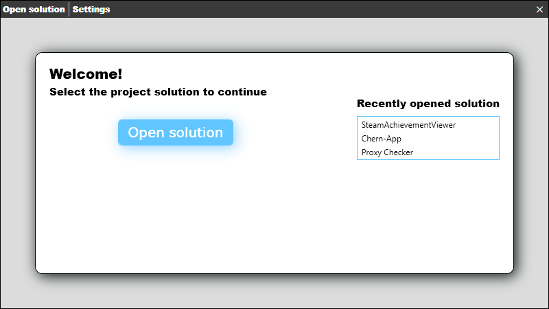
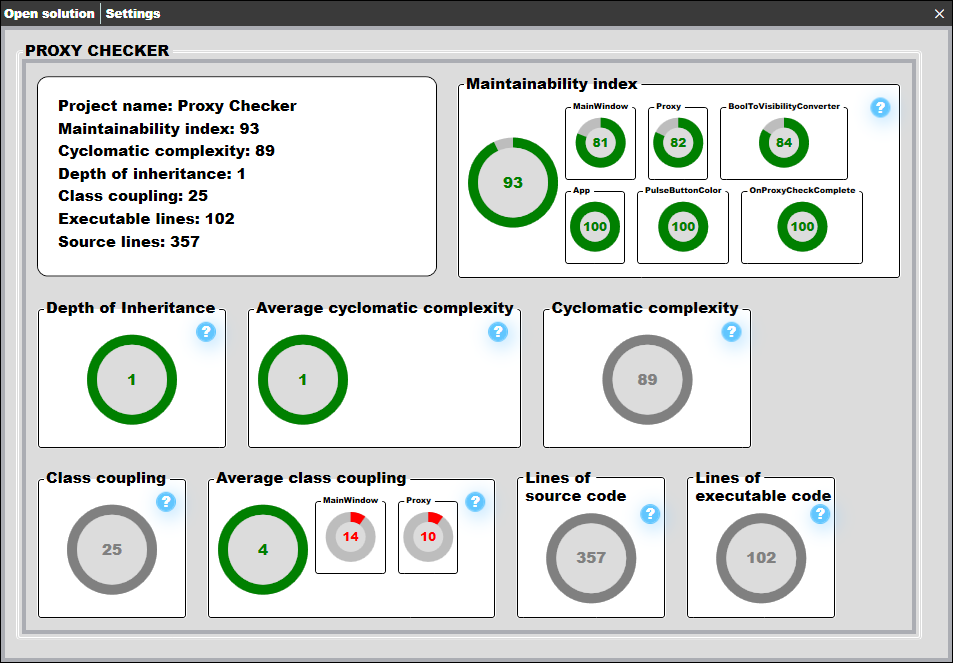

# C-Sharp-Project-Analyzer
### Standalone code analyzer for C# Projects
 

# Features
* ### Project metrics computation
  * ### Maintainability index
  * ### Cyclomatic complexity
  * ### Depth of inheritance
  * ### Class coupling
  * ### Executable lines
  * ### Source lines
 

